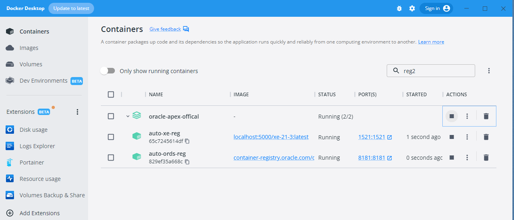
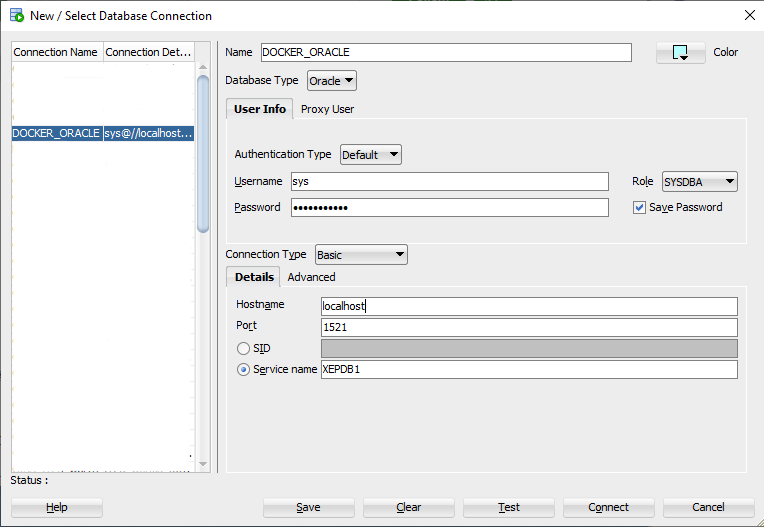

# ESD Oracle APEX Docker Stack
### Deploy a complete Oracle database & APEX stack on Docker using Docker Compose. 

## Overview: 


## Table of Contents
1. **[Prerequisites](#Prerequisites)**
2. **[Version Info](#version-info)**
3. **[How to Install](#how-to-install)**
4. **[Connecting to the Database ](#connecting-to-the-database )**
5. **[Optional Settings](#optional-settings)**
6. **[Alternative Install](#alternative-install)**
7. **[Docker Terms](#docker-terms)**
***
# Prerequisites
- Have Docker Installed
- Create an account & test login to Oracle Image Registry
  - [Oracle Image/Container Registry](https://container-registry.oracle.com/ords/f?p=113:10)

## Version Info
Note: Its best to review details on Oracle container registry website, but pulling latest images as of (11-22-2022) from oracle will have the following versions:

APEX Environment | ORDS | Oracle Database
 --- | --- | --- |
APEX 22.1.0 |  ORDS 22.3.1  | Oracle Database XE Release 21c (21.3.0.0)

---
## How to Install 
## Step 1: Download and/or Clone this Git Repo
### Directory Structure:
```
oracle-apex-offical
  ---- docker-compose.yml
  ---- variables
      ---- conn_string.txt
```
### Step 2: Update the "conn_string.txt" with variables as you see fit
```
CONN_STRING=sys/PASSWORDHERE@database:1521/XEPDB1
```
Note: The conn_string.txt file will be deleted when the container starts. The database connection details are not held in environment variables in the container.
### Step 3: In a text editor, update "docker-compose.yml" with password set in "conn_string.txt" file
```
services:
  auto-xe-reg:
    container_name: auto-xe-reg
    image: container-registry.oracle.com/database/express:latest
    ports: 
      - 1521:1521
    environment:
      - ORACLE_PWD=PLACEPASSWORDHERE
    volumes:
      - db-vol-reg:/opt/oracle/oradata
    hostname: database
  auto-ords-reg:
    container_name: auto-ords-reg
    restart: always
    depends_on:
      - auto-xe-reg
    volumes:
      - ./variables:/opt/oracle/variables
      - ords-config-reg:/etc/ords/config
    ports:
      - 8181:8181
    image: container-registry.oracle.com/database/ords:latest
volumes:
  db-vol-reg:
    name: db-vol-reg
    external: false
  ords-config-reg:
    name: ords-config-reg
networks:
  default:
    name: ords-database-network
```
### Step 4: In a command(cmd) window, Log into Oracle Registry
```
docker login container-registry.oracle.com
```
### Step 5: In CMD, navigate to the folder with the updated "docker-compose.yml" file
```
cd/

cd C:\Users\FIRSTNAME.LASTNAME\Desktop\esd-oracle-apex-docker-stack\oracle-apex-offical
```
### Step 6: Run Docker Compose File
```
docker compose up
```
## And Done. The downloading of the images, and creating of the stack happens automatically 
### First time setup may take a few moments to download the images. 


## Connecting to the Database 
## Connecting to the Database Within the Container
```
docker exec -it auto-xe-reg sqlplus / as sysdba
docker exec -it auto-xe-reg sqlplus sys/<your_password>@XE as sysdba
docker exec -it auto-xe-reg sqlplus system/<your_password>@XE
docker exec -it auto-xe-reg sqlplus pdbadmin/<your_password>@XEPDB1
```
## Connecting to the Database Outside of the container using SQL*Plus:
```
qlplus sys/<your password>@//localhost:1521/XE as sysdba
```
## Connecting to the Database via SQL Dev:


---
# Optional Settings
### Reuse Existing Database or Mount Database & ORDS containers to host directory folders for database/file persistence
In the "docker-compose.yml" file, replace volumes with a directory path.

repalce:
```
    volumes:
      - db-vol-reg:/opt/oracle/oradata
```
with
```
    volumes:
      - <writable_directory_path>:/opt/oracle/oradata
```
example:
```
    volumes:
      - C:\Oracle\opt\oracle\oradata:/opt/oracle/oradata
```

### Configure & Change ORDS Container default config options
For ords 22.2 java ords.war deprecated
- https://www.oracle.com/tools/ords/ords-relnotes-222.html
- https://oracle-base.com/articles/misc/oracle-rest-data-services-ords-standalone-mode-22-onward

View current commands:
- ords config info

Examples:
- ords config set jdbc.MinLimit 5
- ords config set jdbc.MaxLimit 30
- ords config set jdbc.InitialLimit 15
- ords config set jdbc.MaxStatementsLimit 20
- ords config set jdbc.InactivityTimeout 3600
- ords config set jdbc.statementTimeout 1800
- ords config set jdbc.MaxConnectionReuseCount 2000

---
# Alternative Install
### Alt Install (1): Use Community Docker Images, by using the "oracle-apex-community" directory of files with the same steps as above
Various versions and options available. I would recommended to use the latest version(regular) if seeking a balance of image size and features. Slim version is not compatiable with Oracle Apex. 
- https://hub.docker.com/r/gvenzl/oracle-xe

### Alt Install (2): Build your own image - coming soon
---

## Docker Terms
Docker:
  - Platform for creating and running containers

Docker Compose File:
  - tool for deining and running multi-container docker stack/apps
  - get app running in one command
  - Can be used in a Continuous Integration and Continuous Deployment (CI/CD) Pipeline

Docker file(can be used or ran via command line)
  - Build instructions for an image

Docker image
  - Made with build command
  - Read only
  - Source code. Template with all files needed to make container

Docker container: 
  - Made with run command
  - read-write
  - An instance of an image. 
  - Can have multiple containers to one image.
  - Can be saved as a new image like a snapshot

Docker volume
  - Storage for persistent data generated by docker container
  - Other option is to mount to filesystem directly 
